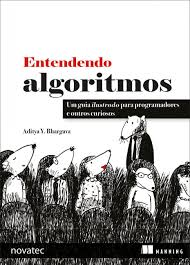

 

## 🧑‍💻 Sobre Mim

E aí! Sou o Daniel 👋

Sou estudante de Engenharia de Software e gosto muito de tecnologia, computadores, jogos e música. Também sou curioso e sempre acabo aprendendo alguma coisa nova por aí

 Cruzeirense de sangue💙🦊 

Minhas nerdices favoritas são Metal Gear, Red Dead Redemption e Guitar Hero

Recentemente comecei a aprender a tocar violão. Ainda tô naquela fase de tentar fazer as coisas soarem direito 🎸

Também gosto de jogar basquete sempre que dá 🏀

Esse é meu cantinho por aqui. Fica à vontade pra dar uma olhada nos meus projetos!

 

## &nbsp; Languages ​​and technologies:

 

## ⌨️ Stats

 

## 📚 Leituras Técnicas

<table>
  <tr>
    <td align="center">
      
<b>Entendendo Algoritmos</b>

      
    </td>
  </tr>
</table>

 

## 🌐 Entre em contato comigo

 

