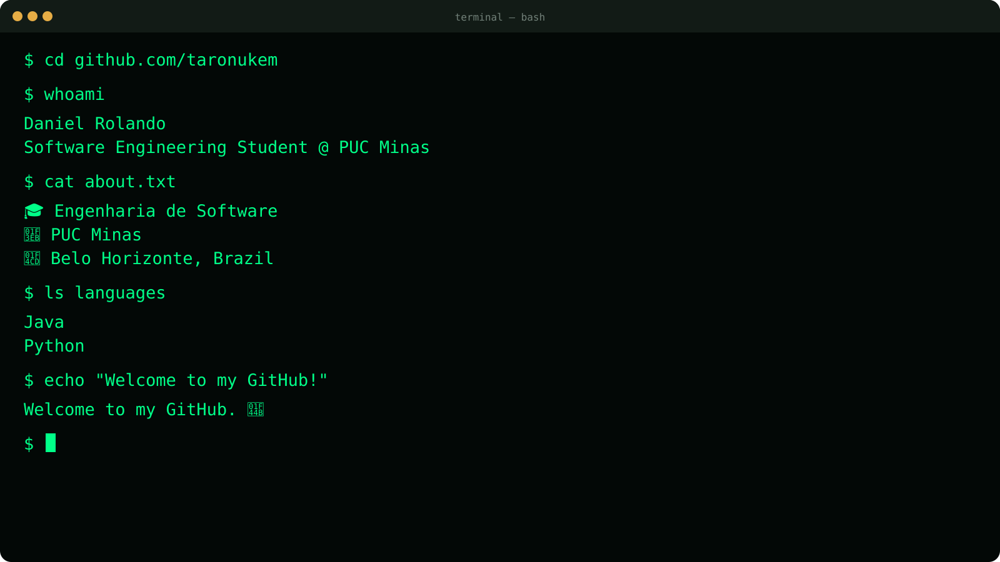

# Hello, I'm Daniel Rolando 👋

  

 

## 🧑‍💻 About Me

Hey, I'm Daniel! 👋

I'm an engineering student and developer who likes computers, games, music, and learning random things just because I got curious about them.

I'm also a **Cruzeiro** fan 💙🦊

I really enjoy playing games, and I'm a big fan of **Metal Gear**, **Red Dead Redemption**, and **Guitar Hero**. 🎮

I've also recently started trying to learn **guitar**. I'm still very much in the *"trying to make it sound good"* phase. 🎸

I also enjoy playing **basketball** whenever I get the chance. 🏀

Anyway, this is my little corner of GitHub. Feel free to look around!

 

## &nbsp; Languages ​​and technologies:

 

## ⌨️ Stats

 

## 🌐 Connect with Me

 

<i>Thanks for stopping by!👋</i>

